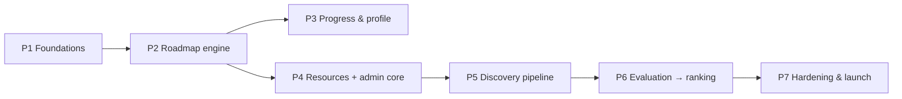

# CPGS MVP — Phased Implementation Plan

Derived entirely from [DESIGN.md](../DESIGN.md) v2.0.0 — §33 (Team Responsibilities) and §34 (Development Plan). No requirements invented; every task traces to a section or FR-ID.

**Team:** 3 developers · **Timeline:** ~7 weeks + 1 buffer · **Target:** demo-ready `v0.1.0`

---

## Phase Index

| # | File | Weeks | Objective | Lead | Depends on |
|---|------|-------|-----------|------|------------|
| P1 | [PHASE-1-foundations.md](PHASE-1-foundations.md) | 1 | Skeleton runs locally + deploys hello-world | Dev 2 | — |
| P2 | [PHASE-2-roadmap-engine.md](PHASE-2-roadmap-engine.md) | 1–2 | Browsable catalog from seeds | Dev 1 + Dev 2 | P1 |
| P3 | [PHASE-3-progress-profile.md](PHASE-3-progress-profile.md) | 2–3 | Learners can track progress | Dev 1 | P2 |
| P4 | [PHASE-4-resources-admin.md](PHASE-4-resources-admin.md) | 3–4 | Product usable *without* AI | Dev 2 | P2 |
| P5 | [PHASE-5-discovery-pipeline.md](PHASE-5-discovery-pipeline.md) | 4–5 | Real candidates reach the queue | Dev 3 | P4 |
| P6 | [PHASE-6-evaluation-ranking.md](PHASE-6-evaluation-ranking.md) | 5–6 | AI judgment lands in review queue | Dev 3 | P5 |
| P7 | [PHASE-7-hardening-launch.md](PHASE-7-hardening-launch.md) | 7 (+8 buffer) | Demo-ready, deployed, monitored | All · D2 ops | P6 |

---

## Dependency Graph

P3 and P4 both branch off P2 and may overlap (weeks 2–4).

---

## Ownership Map (§33.1)

| Developer | Area | Owns end-to-end |
|---|---|---|
| **Dev 1** | `apps/web` | Design system, learner surfaces, dashboard, auth UX, ISR/revalidate wiring |
| **Dev 2** | `apps/api`, DB, deploy | Schema/migrations, REST API, auth, admin HTTP layer, CI/CD, hosting |
| **Dev 3** | `ai/*` | Pipeline stages, prompts, scoring/dedup/ranking, golden set, cost controls |

Shared: everyone reviews everywhere; weekly 30-min contract sync; seeds co-authored (D3 content quality, D2 schema).

---

## Non-Blocking Contracts (§33.2)

| Seam | Contract | Unblocks |
|---|---|---|
| FE ↔ BE | OpenAPI snapshot (`shared/contracts/openapi.json`) is the interface; stub routers with fixtures from P1; FE codes against generated types immediately | Frontend never waits for endpoints |
| BE ↔ AI | `PipelineRunner.run_topic_discovery(topic_id) -> search_run_id`; `search_runs` row is the status protocol; admin routes wired against a fake runner in P4 | Admin UI complete before real AI lands |
| AI ↔ content | Recorded fixtures in `ai/evaluation/golden/` + `scripts/mock-ai-run.py` populate candidates offline | Review flows testable with zero API spend |
| Seeds ↔ all | Seed JSON schema validated in CI from P1 | Roadmap structure frozen early |

## Integration Timeline (§33.3)

- **P1** — contract freeze: OpenAPI v1 + seed JSON schema.
- **P3** — stub→real swap for CRUD endpoints.
- **P5–P6** — fake runner→real runner swap (one env var).
- **P7** — full-stack hardening together.

---

## Conventions Used in Phase Files

1. **Header block** — objective / weeks / lead / dependencies / requirement coverage.
2. **Entry criteria** — what must exist before starting.
3. **Task checklists** — grouped per developer, each item tagged `FR-xx` or a `§` reference into DESIGN.md.
4. **Exit criteria** — copied verbatim from §34.
5. **Verification** — concrete commands/acceptance checks.
6. **Risks & fallbacks** — from §34 risk buffers.

---

## Risk Buffers (§34)

- If Tavily/OpenAI integration slips → **P4 guarantees a demoable product** without AI.
- If pgvector dedup slips → tier-1 hash dedup ships alone, flagged honestly.
- Cut order under pressure (P7): embedding dedup tier 3 → YouTube/GitHub special extractors → interests-based catalog boost.

---

## Guiding Principles Reminder (§Guiding Principles)

P1 simplest-system-first · P2 AI does useful work only · P3 deterministic over LLM where possible · P4 LLMs for semantics · P5 human gate on publish · P6 no crawl-the-internet claims · P7 clean extension points · P8 justify every technology.

*Plan version 1.0.0 · Generated from DESIGN.md v2.0.0 · © 2026*
